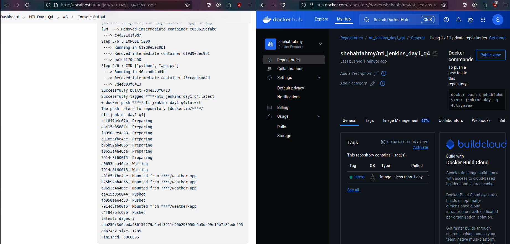

# Day 1

1) What is Jenkins used for?

-> Open-source automation server to build CI/CD pipelines.

---

2) Install Jenkins with docker image.
    ```bash
    docker run -d \
      --name jenkins \
      -p 8080:8080 \
      -p 50000:50000 \
      -v /var/jenkins_home:/var/jenkins_home \
      -v /usr/bin/docker:/usr/bin/docker \
      -v /var/run/docker.sock:/var/run/docker.sock \
      -u root \
      jenkins/jenkins:lts
    ```

---

3) What are plugins in Jenkins?

-> Extensions to integrate Jenkins with other tools.

---

4) Create a free style project and link it to a private Git repo containing any Dockerfile then build an image from this Dockerfile and push it to a private docker repo:
- Create a Fine-grained Personal Access Token for Jenkins to access the private repo:
    - Go to GitHub profile **Settings** > **Developer settings** > **Personal access tokens** > **Fine-grained tokens** > **Generate new token**.
        - Grant access to the web application repository only with **Read-Only** permission for "Contents".
- Create Jenkins Credentials: Go to **Manage Jenkins** > **Credentials** > **System** > **Global credentials (unrestricted)** > **Add Credentials**.
        - Choose **Username with password**, then enter your GitHub username, the token as the password, and an ID to be used in the pipeline.
        - Add another **Username with password** for the DockerHub credentials.
- Create a Freestyle Project:
    - Jenkins **dashboard** > **New Item** > Enter a name > **Freestyle project** > **OK**
- Configure Source Code Management > **Git**:
    - Repository URL: `https://github.com/ShehabFahmy/Weather_App`
    - Credentials: `NTI_Jenkins_Day1`
    - Branch Specifier: `*/main`
- **Build** > **Add build step** > **Execute shell**:
```bash
IMAGE_NAME=shehabfahmy/nti_jenkins_day1_q4
TAG=latest
echo "$DOCKER_PASSWORD" | docker login -u "$DOCKER_USERNAME" --password-stdin
docker build -t $IMAGE_NAME:$TAG .
docker push $IMAGE_NAME:$TAG
```
- **Build Environment** > **Use secret text(s) or file(s)** > **Add** > **Username and password (separated)**:
    - Username Variable: `DOCKER_USERNAME`
    - Password Variable: `DOCKER_PASSWORD`
    - Credentials: `my-dockerhub-cred`

<p align="center">
  
</p>

---

5) Run another freestyle project to run bash script located on a GitHub repo:
- Create a Freestyle Project:
    - Jenkins **dashboard** > **New Item** > Enter a name > **Freestyle project** > **OK**
- Configure Source Code Management > **Git**:
    - Repository URL: `https://github.com/ruanyf/simple-bash-scripts`
    - Credentials: `-none-`
    - Branch Specifier: `*/master`
- **Build** > **Add build step** > **Execute shell**:
```bash
chmod +x scripts/hello-world.sh
scripts/hello-world.sh
```

<p align="center">
  
</p>

---

6) Run pipeline project to build, tag and push Docker image in an incremental way using Jenkins global variable:
- Create Jenkins Credentials for Docker Hub account (Same as in Q4).
- Create a Pipeline:
    - Jenkins **dashboard** > **New Item** > Enter a name > **Pipeline** > **OK**
    - Pipeline script:
        ```Groovy
        pipeline {
            agent any

            environment {
                IMAGE_NAME = "shehabfahmy/nti_jenkins_day1_q6"
                TAG = "${BUILD_NUMBER}"
                DOCKER_CREDENTIALS_ID = "my-dockerhub-cred"
            }

            stages {
                stage('Clone Repo') {
                    steps {
                        git url: 'https://github.com/ianmiell/simple-dockerfile', branch: 'master'
                    }
                }

                stage('Build Docker Image') {
                    steps {
                        script {
                            sh "docker build -t ${IMAGE_NAME}:${TAG} ."
                        }
                    }
                }

                stage('Push to Docker Hub') {
                    steps {
                        withCredentials([usernamePassword(credentialsId: "${DOCKER_CREDENTIALS_ID}", usernameVariable: 'DOCKER_USER', passwordVariable: 'DOCKER_PASS')]) {
                            sh """
                                echo "$DOCKER_PASS" | docker login -u "$DOCKER_USER" --password-stdin
                                docker push ${IMAGE_NAME}:${TAG}
                            """
                        }
                    }
                }
            }
        }
        ```

<p align="center">
  
</p>

---
