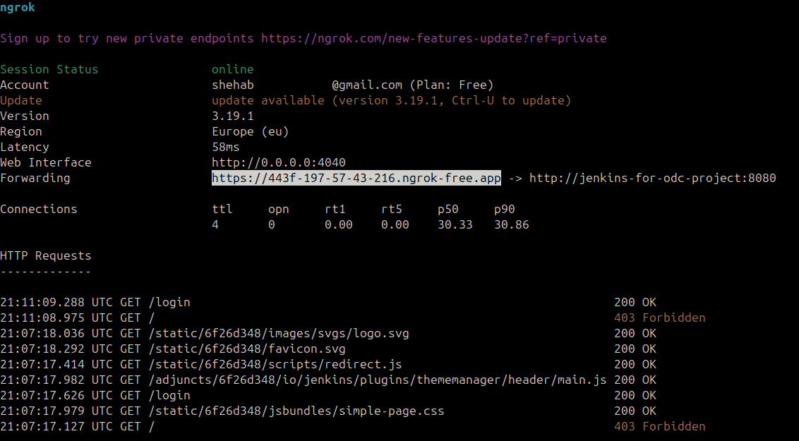
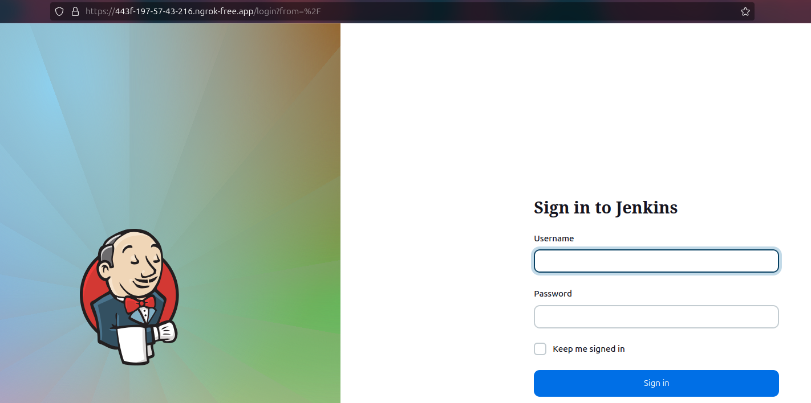
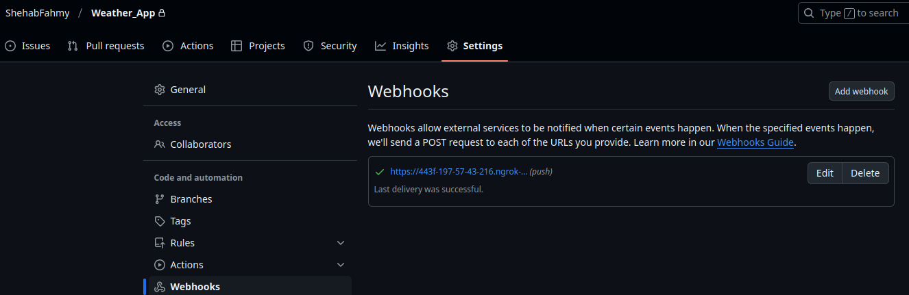
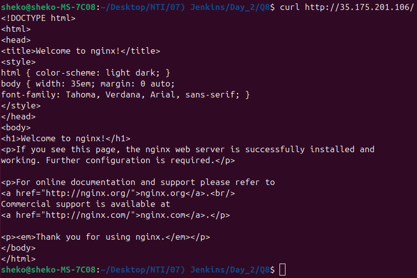
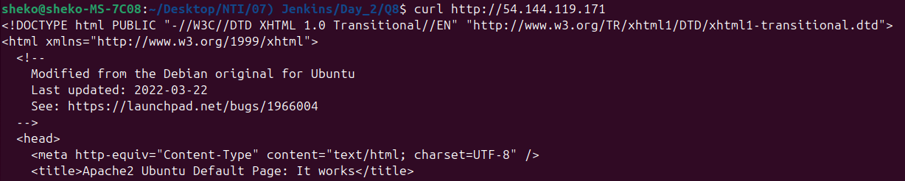

1. What scripting language is Jenkins pipeline syntax based on?

-> Groovy.

2. What are the ways you can write pipeline in Jenkins?

-> Declarative and Scripted.

3. Create a Jenkins pipeline for your repo and use script file (Jenkinsfile) to write pipeline syntax:
 
4. Create another Multibranch pipeline and filter branches to contain only (master, dev, test):

5. Create a parameterized pipeline:

6. Trigger Jenkins pipeline from terminal:
- Get your user's API token: Jenkins > User > Configure > API Token
- Send a POST request to Jenkins REST API:
    ```bash
    curl -X POST "http://localhost:8080/job/NTI_Day2_Q6/build" \
      --user "shehab:<api-token>"
    ```

7. Activate a Webhook in GitHub to send commits to Jenkins:
##### Ngrok Configuration
Since Jenkins was used locally, GitHub wouldn't be able to access it. Therefore, a tunneling service such as Ngrok was used to expose `localhost:8080`.
1. Instead of installing the entire tool, an Ngrok container was used and added to the same Docker network as the Jenkins container:
```sh
docker run --rm -it \
--name ngrok-container-for-jenkins \
--network jenkins-network \
-e NGROK_AUTHTOKEN=$(cat ./Secrets/ngrok_authtoken) \
ngrok/ngrok \
http jenkins-for-odc-project:8080
```
- ***Note:*** Make sure to run the previous command in the project directory.
2. A new window will open in your terminal after executing the previous command:

3. Use the URL in the `forwarding` row to access the Jenkins server:

##### GitHub Webhook Configuration
1. Go to the repository **Settings** > **Webhooks** > **Add Webhook**:
    - Payload URL: `https://<your-ngrok-url>/github-webhook/`
    - Content type: `application/json`
    - Leave the rest as default.
2. Add webhook.
3. Refresh the page. You should see that it is working:


8. Run a pipeline to make an EC2 using Terraform and by Ansible run any script on it  (all steps are done through the pipeline):
1. Create a Jenkins container with Terraform and AWS:
    ```bash
    sudo mkdir /var/jenkins_home/workspace/NTI_Day2_Q8
    sudo cp * /var/jenkins_home/workspace/NTI_Day2_Q8
    docker run -d --rm \
      --name jenkins-container-for-day2 \
      -p 8080:8080 \
      -p 50000:50000 \
      -v /var/jenkins_home:/var/jenkins_home \
      -v /usr/bin/terraform:/usr/bin/terraform \
      -v ~/.aws:/root/.aws \
      -v /usr/bin/docker:/usr/bin/docker \
      -v /var/run/docker.sock:/var/run/docker.sock \
      -u root \
      jenkins/jenkins:lts
    ```
2. Create the AWS infrastructure using Terraform.
3. Create an [Ansible Playbook](Q8/playbook.yaml) to install Nginx web server.
4. Create a [Jenkins pipeline](Q8/Jenkinsfile) to run everything seamlessly. 

<p align="center">
  <strong>Final Result</strong>
  <br>
  
</p>

9. Run a pipeline to run a bash script passed from Jenkins-manged files to be run on a private EC2 instance:
1. Install `Config File Provider` and `SSH Agent Plugin` plugins.
2. Create a [bash script](Q9/install-apache.sh) to install Apache web server.
3. Add the bash script to Jenkins Managed Files: Jenkins > Manage Jenkins > Managed files > Add a new Config:
    - Type: `Custom file`
    - ID: `nti-day2-q9-bash-script`
    - Name: `install-apache.sh`
    - Content: [install-apache.sh](Q9/install-apache.sh)
4. Add SSH Key as a Jenkins Credential.
5. Create and run the [pipeline](Q9/Jenkinsfile).

<p align="center">
  
</p>
