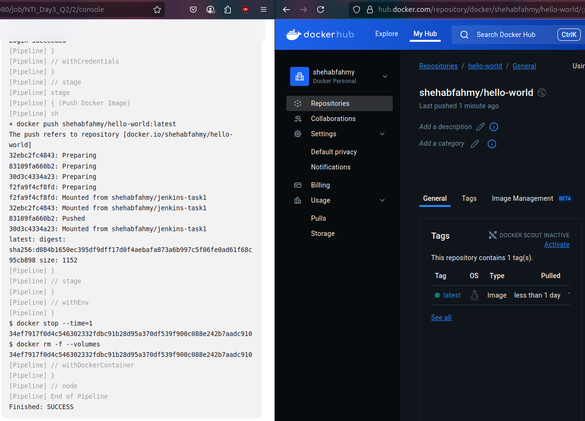
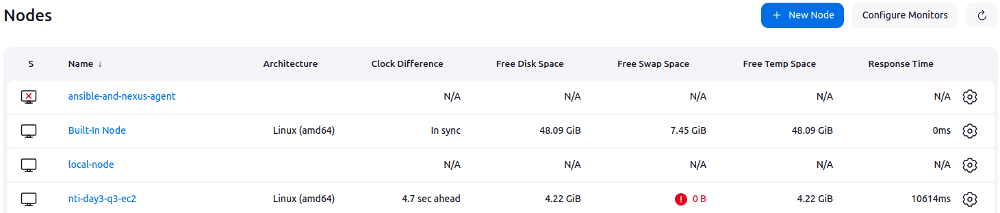

1. Run a pipeline to deploy any deployment on a kubernetes cluster (minikube)

---

2. Run a pipeline to build and publish a Dockerfile using dynamic slave docker container
- Install `Docker Pipeline` plugin.
- Configure Docker as Cloud in Jenkins: Jenkins > Manage Jenkins > Clouds > New cloud:
    - Cloud name: `Docker_Server`
    - Type: `Docker`
    - Docker Host URI: `unix:///var/run/docker.sock`
    - Add Docker Template:
        - Labels: `docker-agent`
        - Name: `docker-agent`
        - Docker Image: `jenkins/inbound-agent`
        - Remote File System Root: `/home/jenkins/agent`
- Create a new [pipeline](Q2/Jenkinsfile).

<p align="center">
  
</p>

---

3. Run a pipeline on a static slave as EC2 server
- Launch an EC2 instance with user data to install Java JDK:
```bash
sudo apt update && sudo apt install -y openjdk-11-jdk  # Ubuntu
# sudo yum install -y java-11-openjdk  # Amazon Linux
```
- Add a new agent on the master node: Manage Jenkins > Nodes > New Node:
    - Node name: `nti-day3-q3-ec2`
    - Type: `Permanent Agent`
    - Remote root directory: `/home/ubuntu`
    - Labels: `ec2`
    - Launch method: `Launch agents via SSH`
        - Host: `EC2 public IP`
        - Credentials: Username with Private Key
        - Host Key Verification Strategy: `Non verifying Verification Strategy`
    - Advanced:
        - JavaPath: `/usr/bin/java`

<p align="center">
  
</p>

---

4. Explain different types of jobs rather than Freestyle pipeline and Multibranch
- Pipeline: uses a Jenkinsfile or inline script written in Groovy to define the entire CI/CD pipeline as code.
- Folder: organizes large numbers of jobs into a hierarchy for better management.
- Multi-configuration: runs the same job with different configurations, such as different OS, JDK versions, or environments.
